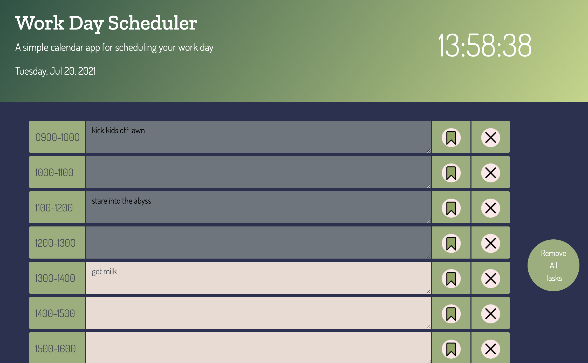

# work-tracker
A work-day scheduler to keep track of your hours.
https://eliselabonte.github.io/work-tracker/

The clock above displays the current time in ECT.

Enter tasks completed into the text areas, and save them locally using the save button.
Clear tasks using the corresponding "x" button, and clear all tasks using the "clear all tasks" button.

Hour blocks change color to gray once that time slot has passed.

Project utilizes jQuery, day.js, localStorage, and Bootstrap
